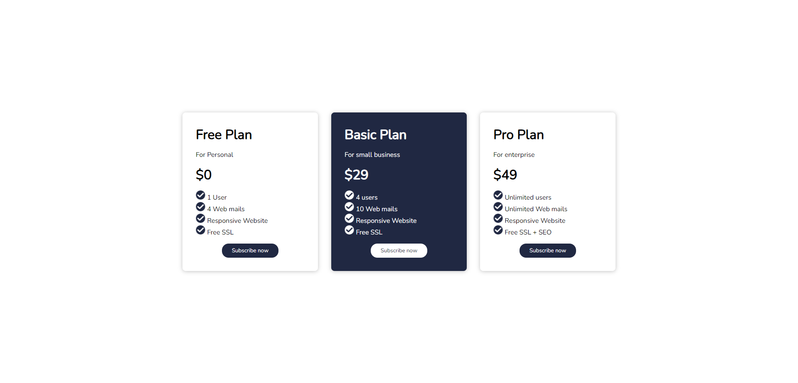

# Answers - [position-css]
### Profile Links : [rahuldutta.bio.link](https://rahuldutta.bio.link)

### 01.

CSS Flexbox and CSS Grid are two distinct layout models in CSS, each designed to solve different layout challenges. Here are the main differences between them and when you might choose to use one over the other:

1. **Layout Orientation**:
   - **Flexbox:** Primarily deals with one-dimensional layouts, either in a row or a column. It is well-suited for laying out items within a container in a linear fashion, such as navigation menus, lists, or aligning items within a single axis.
   - **Grid:** Deals with two-dimensional layouts, allowing you to create rows and columns simultaneously. It's ideal for creating complex grid structures with rows and columns, such as entire web page layouts or tables.

2. **Alignment**:
   - **Flexbox:** Emphasizes content alignment along the main axis (either horizontally or vertically) and can control alignment of items within a single row or column.
   - **Grid:** Provides precise control over the placement and alignment of items in both the row and column directions, making it more versatile for complex layouts.

3. **Use Cases**:
   - **Flexbox:** Suitable for elements within a container where you want to distribute space along a single axis, like aligning buttons horizontally or vertically in a toolbar. It's also handy for creating flexible, dynamic layouts within a container.
   - **Grid:** Best for creating grid-like structures, such as a main content area divided into columns, sidebars, and header/footer sections. It's also great for creating responsive layouts where items should adapt to various screen sizes and positions.

4. **Nested Layouts**:
   - **Flexbox:** Works well for nesting within another Flexbox container, allowing for flexible alignment within individual rows or columns. It's often used for aligning items within a larger Grid cell.
   - **Grid:** Offers robust support for nesting. You can create a Grid layout within a Grid cell, making it easy to create complex, nested structures like magazine-style layouts.

5. **Ordering**:
   - **Flexbox:** Allows you to change the order of elements within the same container using the `order` property.
   - **Grid:** Lacks a built-in property for changing the order of grid items, as it primarily focuses on creating grid structures. However, you can still control order by changing the source order in the HTML.

6. **Browser Support**:
   - Both Flexbox and Grid have excellent browser support in modern browsers. However, if you need to support older browsers, Flexbox tends to have slightly better compatibility.

7. **Complexity**:
   - **Flexbox:** Generally simpler to understand and use for one-dimensional layouts.
   - **Grid:** Offers more extensive control over two-dimensional layouts but can be more complex, especially for beginners.

### 02.

The Flexbox layout model in CSS provides several key properties that help control the arrangement and alignment of flex items within a flex container. Here's an explanation of the role of each property:

1. **justify-content:**
   - `justify-content` determines how flex items are distributed and aligned along the main axis of the flex container (the primary axis along which flex items are laid out).
   - It accepts various values, including:
     - `flex-start` (default): Items are packed toward the start of the main axis.
     - `flex-end`: Items are packed toward the end of the main axis.
     - `center`: Items are centered along the main axis.
     - `space-between`: Items are evenly spaced along the main axis with no space at the start or end.
     - `space-around`: Items are evenly spaced along the main axis with equal space around them.
     - `space-evenly`: Items are evenly spaced along the main axis with equal space around them and at the start and end.
   - This property is particularly useful for controlling the horizontal or vertical alignment of items within a flex container.

2. **align-items:**
   - `align-items` determines how flex items are aligned along the cross-axis of the flex container (the axis perpendicular to the main axis).
   - It accepts various values, including:
     - `stretch` (default): Items stretch to fill the entire cross-axis.
     - `flex-start`: Items are aligned at the start of the cross-axis.
     - `flex-end`: Items are aligned at the end of the cross-axis.
     - `center`: Items are centered along the cross-axis.
     - `baseline`: Items are aligned at their baselines (the line where the text sits).
   - This property is useful for controlling the vertical or horizontal alignment of items within a flex container.

3. **gap:**
   - `gap` (or its related properties `gap`, `row-gap`, and `column-gap`) is used to specify the space between flex items within a flex container.
   - It controls the spacing between items along both the main and cross axes.
   - You can use `gap` to add space between flex items, making it easier to create well-spaced and visually appealing layouts.

4. **flex-direction:**
   - `flex-direction` defines the direction in which flex items are laid out within the flex container. It determines the main axis and the direction in which items flow.
   - It accepts values like:
     - `row` (default): Items are laid out in a row from left to right (for horizontal layouts).
     - `row-reverse`: Items are laid out in a row from right to left.
     - `column`: Items are laid out in a column from top to bottom (for vertical layouts).
     - `column-reverse`: Items are laid out in a column from bottom to top.
   - This property is crucial for controlling the flow of items within the flex container.

5. **flex-wrap:**
   - `flex-wrap` determines whether flex items should wrap to a new line or stay on the same line if they overflow the flex container's width or height.
   - It accepts values like:
     - `nowrap` (default): Items stay on the same line and may overflow the container.
     - `wrap`: Items wrap to the next line when they overflow the container.
     - `wrap-reverse`: Items wrap to the next line, but in reverse order.
   - `flex-wrap` is useful for creating responsive layouts that adapt to the available space.


### 03.

Here is the code to center a div horizontally and vertically using CSS Flexbox:

```css
.container {
  display: flex;
  justify-content: center;
  align-items: center; 
}

.center-div {
  width: 100px;
  height: 100px;
  background: blue;
}
```

To center the div horizontally, we set the container to `display: flex` and use `justify-content: center` to align the child div along the main axis (horizontally by default).

To center vertically, we also need to set `align-items: center` to align along the cross axis (vertically by default). 

So with both justify-content and align-items set to center, the inner div will be centered both horizontally and vertically inside the container.

The width, height, and background color set on .center-div are just for demonstration purposes.


### 04.
- [View Live](https://irahuldutta02.github.io/pw-skills-fswd-ja-assignments/006-css-02/flexbox-css/04)
- [Code](https://github.com/irahuldutta02/pw-skills-fswd-ja-assignments/tree/main/006-css-02/flexbox-css/04/)

Output: 



### 05.
- [View Live](https://irahuldutta02.github.io/pw-skills-fswd-ja-assignments/006-css-02/flexbox-css/05)
- [Code](https://github.com/irahuldutta02/pw-skills-fswd-ja-assignments/tree/main/006-css-02/flexbox-css/05/)

Output: 

