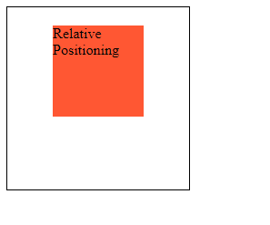
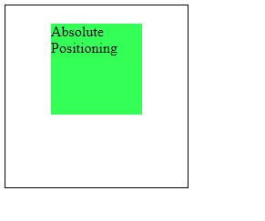

## 02. Explain the difference between Absolute and Relative positioning.

In web development, absolute and relative positioning are CSS properties that allow you to precisely control the placement of HTML elements within their containing elements. They are often used in combination with the `position` property in CSS. Here's an explanation of each with code examples:

### 1. **Relative Positioning**:

   Relative positioning is based on the element's natural position within the document flow. When an element is relatively positioned, it can be moved relative to its original position.

   ```html
   <!DOCTYPE html>
   <html lang="en">
   <head>
      <meta charset="UTF-8" />
      <meta name="viewport" content="width=device-width, initial-scale=1.0" />
      <title>Relative Positioning</title>
      <style>
         .container {
         position: relative;
         width: 200px;
         height: 200px;
         border: 1px solid #000;
         }

         .box {
         position: relative;
         left: 50px;
         top: 20px;
         background-color: #ff5733;
         width: 100px;
         height: 100px;
         }
      </style>
   </head>

   <body>
      <div class="container">
         <div class="box">Relative Positioning</div>
      </div>
   </body>
   </html>
   ```

Output:



In this example, the `.box` element is relatively positioned, which means it's moved 50px to the right and 20px down from its original position within the `.container`.

### 2. **Absolute Positioning**:

   Absolute positioning takes an element out of the normal document flow and positions it relative to its nearest positioned ancestor (an ancestor with `position: relative`, `position: absolute`, or `position: fixed`) or the document itself.

   ```html
   <!DOCTYPE html>
   <html lang="en">
     <head>
       <meta charset="UTF-8" />
       <meta name="viewport" content="width=device-width, initial-scale=1.0" />
       <title>Absolute Positioning</title>
       <style>
         .container {
           position: relative;
           width: 200px;
           height: 200px;
           border: 1px solid #000;
         }

         .box {
           position: absolute;
           left: 50px;
           top: 20px;
           background-color: #33ff57;
           width: 100px;
           height: 100px;
         }
       </style>
     </head>

     <body>
       <div class="container">
         <div class="box">Absolute Positioning</div>
       </div>
     </body>
   </html>
   ```

Output:



In this example, the `.box` element is absolutely positioned inside the relatively positioned `.container`. It is positioned 50px to the right and 20px down from the top-left corner of the `.container`.
