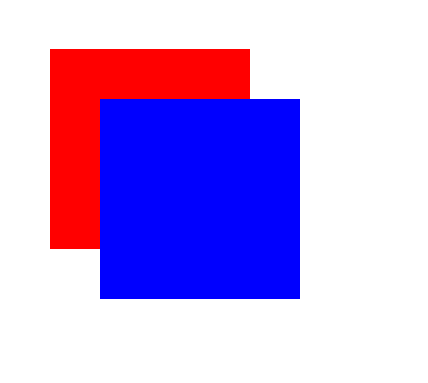

### 05. Explain the z-index, with a code example.
---

`z-index` is a CSS property that controls the stacking order of elements on a web page along the z-axis, which is perpendicular to both the x-axis (horizontal) and y-axis (vertical). It determines which elements appear on top of others when they overlap in the layout. Elements with a higher `z-index` value will be displayed in front of elements with a lower or no `z-index` value.

Here's a code example to illustrate how `z-index` works:

HTML:
```html
<!DOCTYPE html>
<html>
<head>
    <link rel="stylesheet" type="text/css" href="styles.css">
</head>
<body>
    <div class="red-box"></div>
    <div class="blue-box"></div>
</body>
</html>
```

CSS (styles.css):
```css
.red-box {
    width: 200px;
    height: 200px;
    background-color: red;
    position: absolute;
    top: 50px;
    left: 50px;
    z-index: 1;
}

.blue-box {
    width: 200px;
    height: 200px;
    background-color: blue;
    position: absolute;
    top: 100px;
    left: 100px;
    z-index: 2;
}
```
Output: 



In this example:

1. We have two `<div>` elements, one with a class of `red-box` and the other with a class of `blue-box`.

2. Both elements have absolute positioning, which allows us to specify their exact positions on the page.

3. The `z-index` property is used to control the stacking order. The `.red-box` has a `z-index` of 1, and the `.blue-box` has a `z-index` of 2.

4. As a result, the blue box will appear on top of the red box because it has a higher `z-index` value. The red box will be obscured by the blue box.