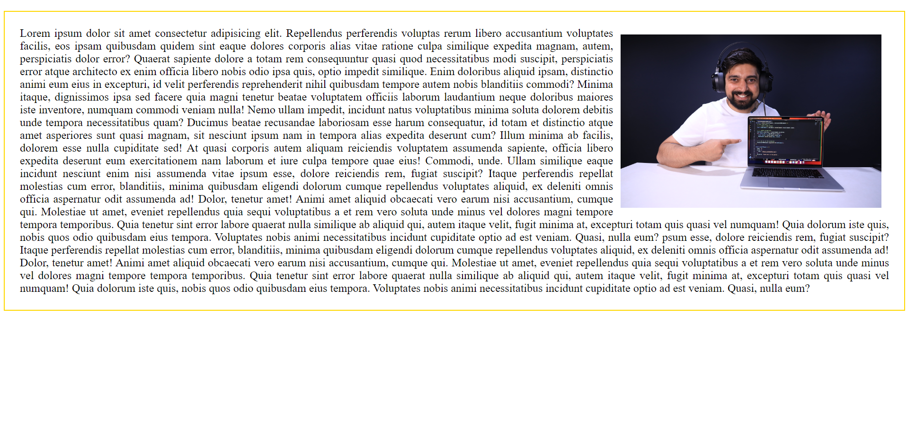

# Answers - [position-css]
### Profile Links : [rahuldutta.bio.link](https://rahuldutta.bio.link)

### 01.
- [View Live](https://irahuldutta02.github.io/pw-skills-fswd-ja-assignments/006-css-02/position-css/01)
- [Code](https://github.com/irahuldutta02/pw-skills-fswd-ja-assignments/tree/main/006-css-02/position-css/01/)

Output:


### 02. Explain the difference between Absolute and Relative positioning.
1. Absolute Positioning:
   - Absolute positioning is a CSS property that allows you to position an element relative to its nearest positioned ancestor, which means an ancestor element that has a CSS position property set to "relative," "absolute," "fixed," or "sticky."
   - When you apply absolute positioning to an element, it is taken out of the normal document flow. This means it does not affect the layout or position of other elements on the page.
   - The element's position is specified using properties like "top," "right," "bottom," and "left," which determine how far the element is from the edges of its nearest positioned ancestor.
   - If there is no positioned ancestor, the element will be positioned relative to the initial containing block, usually the viewport (the visible area of the browser window).

        ```css
        .absolute-element {
        position: absolute;
        top: 20px;
        left: 30px;
        }
        ```

2. Relative Positioning:
   - Relative positioning is also a CSS property used to position an element, but it does so relative to its normal position within the document flow.
   - When you apply relative positioning to an element, it retains its space in the document flow, meaning it still affects the layout and positioning of other elements around it.
   - The element's position can be adjusted using properties like "top," "right," "bottom," and "left," but these adjustments are relative to the element's normal position.

        ```css
        .relative-element {
        position: relative;
        top: 10px;
        left: -5px;
        }
        ```

### 03.
- [View Live](https://irahuldutta02.github.io/pw-skills-fswd-ja-assignments/006-css-02/position-css/03)
- [Code](https://github.com/irahuldutta02/pw-skills-fswd-ja-assignments/tree/main/006-css-02/position-css/03/)

Output:



### 04.
- [View Live](https://irahuldutta02.github.io/pw-skills-fswd-ja-assignments/006-css-02/position-css/04)
- [Code](https://github.com/irahuldutta02/pw-skills-fswd-ja-assignments/tree/main/006-css-02/position-css/04/)


### 05. Explain the z-index, with a code example.

`z-index` is a CSS property that controls the stacking order of elements on a web page along the z-axis, which is perpendicular to both the x-axis (horizontal) and y-axis (vertical). It determines which elements appear on top of others when they overlap in the layout. Elements with a higher `z-index` value will be displayed in front of elements with a lower or no `z-index` value.

Here's a code example to illustrate how `z-index` works:

HTML:
```html
<!DOCTYPE html>
<html>
<head>
    <link rel="stylesheet" type="text/css" href="styles.css">
</head>
<body>
    <div class="red-box"></div>
    <div class="blue-box"></div>
</body>
</html>
```

CSS (styles.css):
```css
.red-box {
    width: 200px;
    height: 200px;
    background-color: red;
    position: absolute;
    top: 50px;
    left: 50px;
    z-index: 1;
}

.blue-box {
    width: 200px;
    height: 200px;
    background-color: blue;
    position: absolute;
    top: 100px;
    left: 100px;
    z-index: 2;
}
```
Output: 


In this example:

1. We have two `<div>` elements, one with a class of `red-box` and the other with a class of `blue-box`.

2. Both elements have absolute positioning, which allows us to specify their exact positions on the page.

3. The `z-index` property is used to control the stacking order. The `.red-box` has a `z-index` of 1, and the `.blue-box` has a `z-index` of 2.

4. As a result, the blue box will appear on top of the red box because it has a higher `z-index` value. The red box will be obscured by the blue box.


